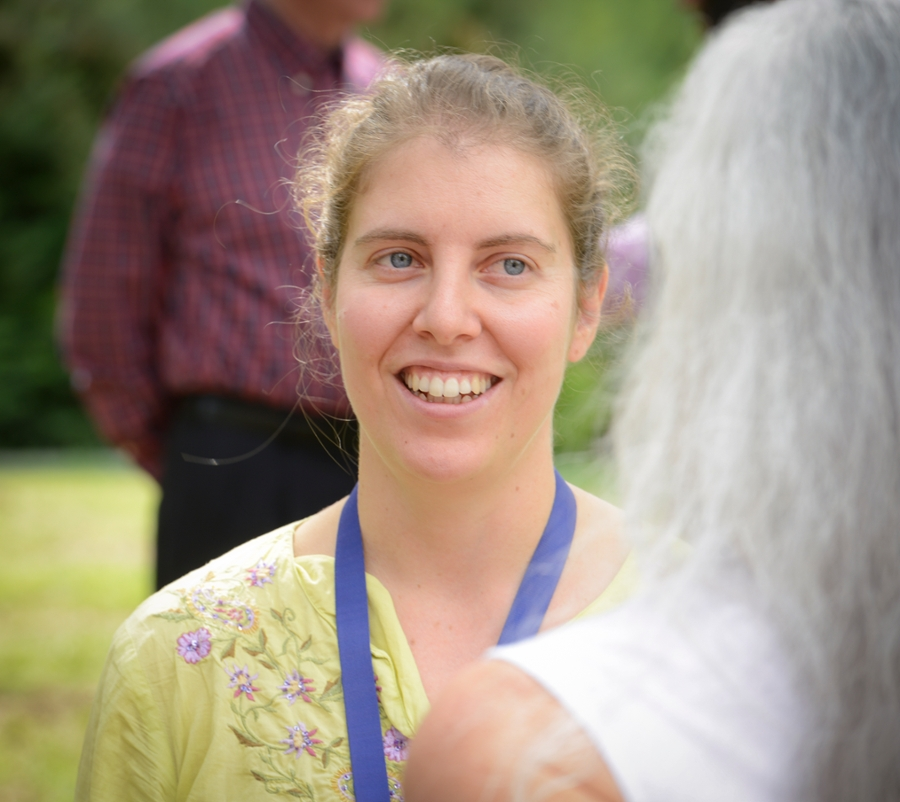
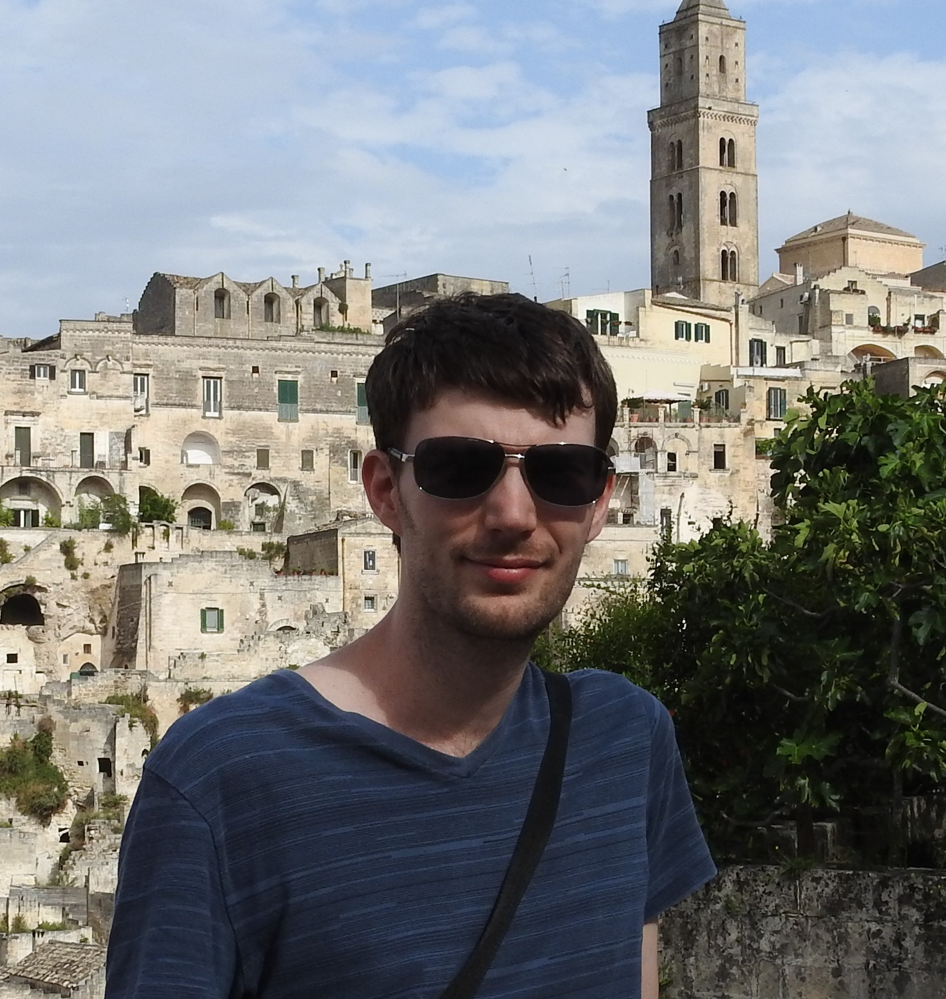
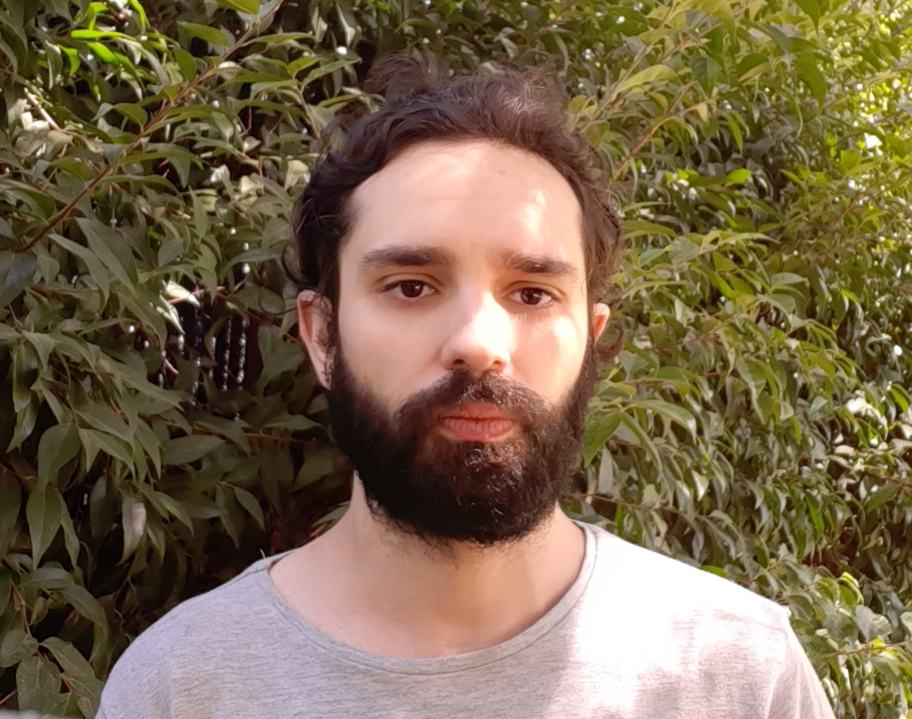

# Beatriz Martinez-Lopez.  

Prof. Beatriz Martínez López (DVM, MPVM, PhD) is Professor in the Department of Medicine and Epidemiology, Agricultural Experiment Station (20%) faculty and Director of the UC Davis Center for Animal Disease Modeling and Surveillance (CADMS). Her research is focused on the development and application of epidemiological tools for supporting more cost-effective and risk-based surveillance and control strategies. She has primarily been working on epidemiological modeling and risk assessment for the evaluation of the potential introduction and/or spread of diseases affecting domestic and/or wild animal populations, such as foot-and-mouth disease, African swine fever, classical swine fever, bovine tuberculosis, Aujeszky´s disease, African horse sickness, bluetongue, avian influenza, West Nile, and Rift Valley Fever. Many of these diseases are considered to be emerging or re-emerging due to globalization, changes in climate and land use. 

Since 2005, she has been collaborating closely with CADMS on projects related to international modeling and surveillance. Recently, she become the director of CADMS, leading the continuing development of new near-real time surveillance and modeling tools and their integration into operational platforms such as the Disease BioPortal, a secure web-based platform system intended for real time routing, sharing, and analyzing animal disease data and information (http://bioportal.ucdavis.edu/).

In the last eight years, she has had the opportunity to collaborate in many national and international research projects and collaborative agreements with government agencies and other bodies. These projects have allowed her to gain experience in epidemiological evaluation, communication and technology transfer in several countries and under very diverse scenarios and audiences (e.g. general public, farmers, private and official veterinarians, consumers, policy makers, etc.). Dr. Martínez López has served a as mentor, advisor or committee member for 13 Masters and PhD students. She has been active in several national and international scientific associations, including service in six scientific committees. She has also been involved in organizing a number of international conferences related to veterinary epidemiology and virology.  
email: beamartinezlopez@ucdavis.edu    
  
_____________________________________________
  
  
# Jose Pablo Gomez-Vazquez

Pablo got his DVM from the "Universidad Autonoma de Nuevo Leon", Mexico in 2015 and his MPVM from UC Davis in 2017. Since he started his MPVM, he has been collaborating with Latin American countries for modeling infectious disease dynamics. Previously he had worked with Peru veterinary services modeling Classical Swine Fever transmission and how it relates to the trade network. Currently Pablo is working with Foot-and-Mouth disease related research in disease free countries to evaluate the potential introduction and dissemination of the disease in disease free countries, both, where vaccination is practiced and not practiced. He also is involved in consulting for the Veterinary Center for Clinical Trials at UC Davis and other projects at CADMS involving dynamic network analysis and other statistical methods. His research involves spatio-temporal analysis of networks, spatial distribution and disease spread modeling.  
email: jpgo@ucdavis.edu  
website: http://jpablo91.github.io/

_____________________________________________

  
# Jerome Baron
  

earned his DVM from the University of Liège, Belgium, in 2013 and his MSc in Veterinary Epidemiology from the London School of Hygiene and Tropical Medicine and the Royal Veterinary College, London, in 2015. After a year working as an epidemiologist in human oncology in the private sector, he started the PhD program  at UC Davis in 2016, and is working as an analyst for CADMS, supporting the partnership with the Veterinary Center for Clinical Trials of UC Davis and other research projects from CADMS. His main interest are in infectious zoonotic disease and he aims to pursue his education and research in that domain.
  
email: jnbaron@ucdavis.edu
  
_____________________________________________

  
# José Manuel Díaz Cao

  

Dr. José Manuel Díaz Cao (DVM, PhD) is a postdoctoral researcher interested in the epidemiology of infectious diseases. He has been working on risk factor analysis and the characterization and modeling of the ways in which diseases are transmitted and maintained in animal populations. He obtained his doctorate at the University of Santiago de Compostela, Spain, and his dissertation focused on reproductive pathogens in domestic ruminants, the analysis of the determinants of exposure and outbreaks, the detection of spatio-temporal trends and how to take advantage of the information generated on farms to anticipate and mitigate risks. He has extended this work to a wide number of pathogens in different animal species, including livestock, wildlife and zoonotic diseases. He also is experienced in the environmental detection of infectious pathogens, laboratory diagnosis and epidemiological and statistical analysis. He is collaborating with the department in the application and development of new methods and epidemiological monitoring systems that allow the information generated in livestock and animal health to be used to inform early on the risks on animal health in order to improve and optimize control, biosecurity and surveillance of infectious pathogens.   

email: jmdiazcao@ucdavis.edu  
